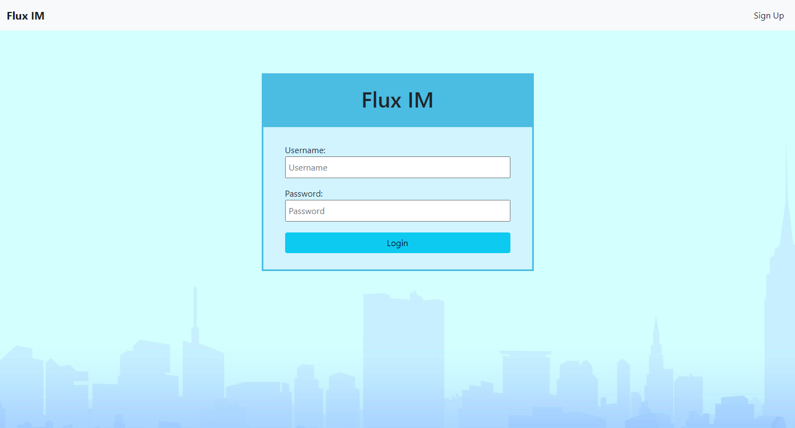
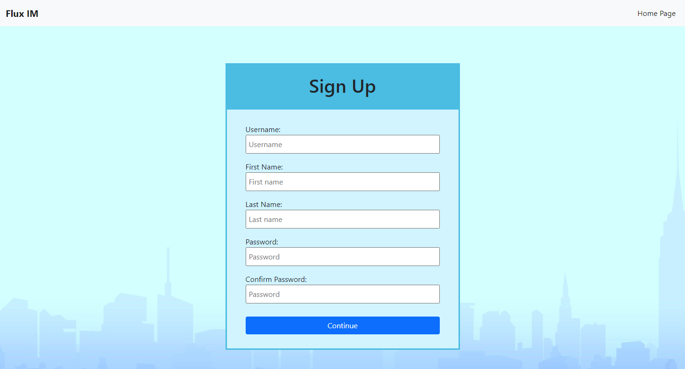
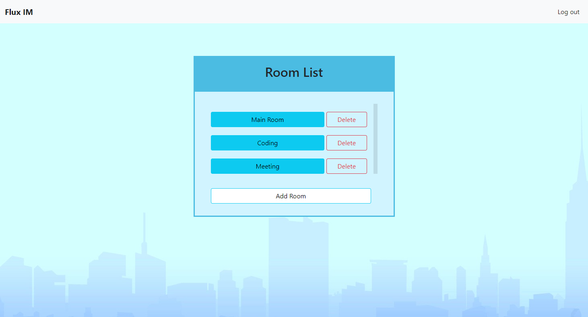
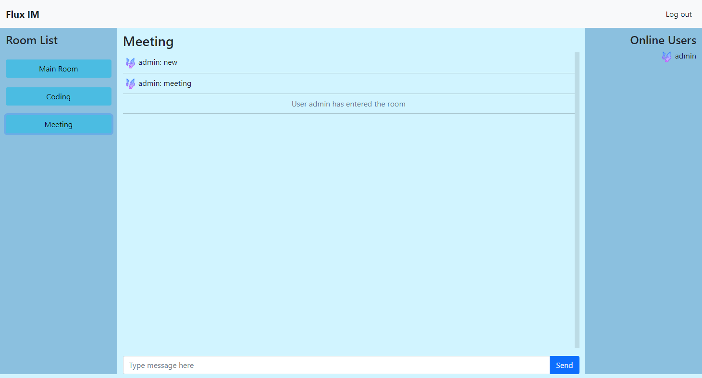

[](https://opensource.org/licenses/ISC)

# Flux-IM

## Deployed on Heroku
https://flux-im.herokuapp.com/

---

## Description
A light weighted chat room application ultilizing the power of Socket.IO and MVC design pattern. Flux-IM utilizes a basic user login system to remember customizable user information, such as avatars and usernames.

---

## Technology Used
* Socket.io
* Node.js
* Express.js
* MySQL
* HTML 5
* CSS 3
* Javascript
* jQuery
* Ajax
* Bootstrap 5
* Heroku
* RESTful API
* Macha.js
* Chai.js
* ESlint

---

## Table of Contents
* [Installation](#installation)
* [Usage](#usage)
* [Contact](#contact)
* [License](#license)
---


## Installation
To insall the application locally, type the following in command-line tool:
```bash
npm install
```

---

## Configure MySQL Database Locally

Inside main directory, you will find a folder named `db`.

   * Make sure you're in the `db` folder of your app.

   * Start MySQL command line tool and login: `mysql -u root -p`.

   * With the `mysql>` command line tool running, enter the command `source schema.sql`. This will run your schema file and all of the queries in it -- in other words, you'll be creating your database.

   * Now insert the entries you defined in `seeds.sql` by running the file: `source seeds.sql`.

   * Close out of the MySQL command line tool: `exit`.

---

## Usage
To start the application, type the following in command-line tool:
```bash
npm start
```
then navigate to http://localhost:8080 in any browser to view the app.



In the login screen, you can either sign up to create your own login information or use the existing testing login infromation:
```
User Name: guest
Password: guest
```



This is the sign up screen, fill all the inform and your account will be created!



After you logged into the application, choose a room to start conversation or just create a new one!



Switch to any other rooms you want by clicking on them on the left side! See who is online on the right and meet more interesting people.

---

## Team Members
* Chang Xiao - Project Manager, visit his [GitHub](https://github.com/sinsinkun)
* Sam Kim - Full Stack Developer, visit his [GitHub](https://github.com/TalkingSkunk)
* Micheal Wong - Front End Developer, visit his [GitHub](https://github.com/Mwong228)
* Tong (Richard) Yang - Back End Developer/DevOps, visit his [GitHub](https://github.com/Dragontalker)

---

## License
Copyright (c) [2021] [Team Flux Capacitor]

Permission is hereby granted, free of charge, to any person obtaining a copy of this software and associated documentation files (the "Software"), to deal in the Software without restriction, including without limitation the rights to use, copy, modify, merge, publish, distribute, sublicense, and/or sell copies of the Software, and to permit persons to whom the Software is furnished to do so, subject to the following conditions:

The above copyright notice and this permission notice shall be included in all copies or substantial portions of the Software.

THE SOFTWARE IS PROVIDED "AS IS", WITHOUT WARRANTY OF ANY KIND, EXPRESS OR IMPLIED, INCLUDING BUT NOT LIMITED TO THE WARRANTIES OF MERCHANTABILITY, FITNESS FOR A PARTICULAR PURPOSE AND NONINFRINGEMENT. IN NO EVENT SHALL THE AUTHORS OR COPYRIGHT HOLDERS BE LIABLE FOR ANY CLAIM, DAMAGES OR OTHER LIABILITY, WHETHER IN AN ACTION OF CONTRACT, TORT OR OTHERWISE, ARISING FROM, OUT OF OR IN CONNECTION WITH THE SOFTWARE OR THE USE OR OTHER DEALINGS IN THE SOFTWARE.
